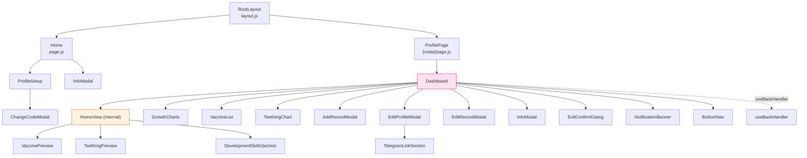
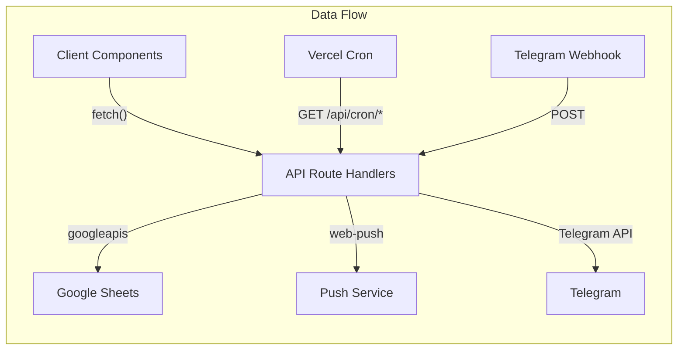

# 🧬 Pe Thui Tracker — Knowledge Graph

> **Last Updated:** 2026-04-21  
> **Version:** 1.5.0  
> **Framework:** Next.js 16 (App Router) · React 19 · TailwindCSS 4  
> **Deployment:** Vercel · PWA (Service Worker)  
> **Database:** Google Sheets API v4 (serverless, per-baby tab architecture)  
> **Notifications:** Web Push (VAPID) + Telegram Bot API

---

## 1. Project Summary

**Pe Thui Tracker** is a Vietnamese-language Progressive Web App for tracking baby development milestones. Each baby profile is identified by a unique **code** (e.g., `SOC010125.0426`) that maps 1:1 to a **Google Sheets tab**. The app has no traditional database — all persistent data lives in a single Google Spreadsheet where each tab represents one baby.

### Core Domains

| Domain | Description |
|--------|-------------|
| **Profile** | Baby identity (name, DOB, gender, avatar, Telegram link) |
| **Growth** | Weight & height tracking over time, with standard-band charting |
| **Vaccines** | 33-vaccine immunization schedule with scheduling & completion tracking |
| **Teething** | 20-tooth eruption tracking with visual jaw chart |
| **Skills** | Age-appropriate developmental milestones from a MASTER sheet |
| **Notifications** | Vaccine reminder cron via Web Push & Telegram |

---

## 2. Architecture Overview

```mermaid
graph TB
    subgraph Client["🖥️ Client (React 19 / PWA)"]
        LP["page.js<br/>Login Page"]
        PP["[code]/page.js<br/>Profile Page"]
        DB["Dashboard"]
        
        subgraph Components["UI Components"]
            PS["ProfileSetup"]
            CCM["ChangeCodeModal"]
            EPM["EditProfileModal"]
            ARM["AddRecordModal"]
            ERM["EditRecordModal"]
            GC["GrowthCharts"]
            VL["VaccineList"]
            VP["VaccinePreview"]
            TC["TeethingChart"]
            TP["TeethingPreview"]
            DSS["DevelopmentSkillsSection"]
            NB["NotificationBanner"]
            IM["InfoModal"]
            ECD["ExitConfirmDialog"]
            TLS["TelegramLinkSection"]
        end
        
        subgraph Layout["Layout"]
            BN["BottomNav"]
            HD["Header"]
        end
        
        subgraph Hooks["Hooks"]
            UBH["useBackHandler"]
        end
    end

    subgraph API["⚡ API Routes (Next.js Route Handlers)"]
        AP["/api/profile<br/>GET · POST"]
        AG["/api/growth<br/>GET · POST · PUT · DELETE"]
        AV["/api/vaccines<br/>GET · POST · DELETE"]
        AT["/api/teeth<br/>GET · POST · DELETE"]
        AS["/api/skills<br/>GET"]
        ANS["/api/notifications/subscribe<br/>POST · DELETE"]
        ANTel["/api/notifications/telegram<br/>DELETE"]
        ANT["/api/notifications/test<br/>GET"]
        ACR["/api/cron/vaccine-reminder<br/>GET (Cron)"]
        ATW["/api/telegram/webhook<br/>POST"]
    end

    subgraph Libs["📦 Server Libraries"]
        GS["google-sheets.js<br/>Auth · CRUD · Sheet Mgmt"]
        CALC["calculations.js<br/>Age · Height · Weight"]
        TG["telegram.js<br/>Send · Webhook"]
        WP["web-push.js<br/>VAPID Setup"]
    end

    subgraph Data["📊 Reference Data"]
        VD["vaccines.js<br/>33 Vaccines"]
        TD["teeth.js<br/>20 Teeth"]
    end

    subgraph External["☁️ External Services"]
        GSH["Google Sheets API"]
        TGA["Telegram Bot API"]
        WPA["Web Push Service"]
        VC["Vercel Cron"]
    end

    %% Client → API
    LP -->|"POST /api/profile"| AP
    PP -->|"GET /api/profile"| AP
    DB -->|"fetch all data"| AG
    DB -->|"fetch all data"| AV
    DB -->|"fetch all data"| AT
    DSS -->|"GET /api/skills"| AS
    EPM -->|"POST /api/notifications/subscribe"| ANS
    NB -->|"POST /api/notifications/subscribe"| ANS

    %% API → Libs
    AP --> GS
    AG --> GS
    AV --> GS
    AT --> GS
    AS --> GS
    ANS --> GS
    ANTel --> GS
    ANT --> GS
    ANT --> WP
    ANT --> TG
    ACR --> GS
    ACR --> WP
    ACR --> TG
    ACR --> VD
    ATW --> GS
    ATW --> TG

    %% Libs → External
    GS --> GSH
    TG --> TGA
    WP --> WPA
    VC -->|"daily 00:00 UTC"| ACR

    %% Component Hierarchy
    PP --> DB
    DB --> GC
    DB --> VL
    DB --> VP
    DB --> TC
    DB --> TP
    DB --> DSS
    DB --> ARM
    DB --> EPM
    DB --> ERM
    DB --> IM
    DB --> ECD
    DB --> NB
    DB --> BN
    DB --> UBH
    LP --> PS
    LP --> IM
    PS --> CCM
    EPM --> TLS

    %% Calculations
    DB --> CALC
    GC --> CALC
```



---

## 3. Google Sheets Data Schema

Each baby's **code** maps to a sheet tab. The sheet layout is:

```
┌────────────────────────────────────────────────────────────────────────────┐
│ Col A-B (Rows 1-5)    │ Col F-I (Row 6+)      │ Col J-L (Row 6+)        │ Col K-L (Row 6+)       │
│ PROFILE               │ VACCINES              │ TEETHING                │ PUSH SUBSCRIPTIONS     │
├────────────────────────┼───────────────────────┼─────────────────────────┼────────────────────────┤
│ A1: "Tên bé"    B1: name    │ F6: Header Row        │ J6: Header Row          │ K6: Header Row         │
│ A2: "Giới tính" B2: gender  │ F7+: VaccineID        │ J7+: ToothID            │ K7+: Push Endpoint     │
│ A3: "Ngày sinh" B3: dob     │ G7+: Ngày tiêm        │ K7+: Ngày mọc           │ L7+: Push Keys (JSON)  │
│ A4: "Avatar"    B4: url     │ H7+: Ngày hẹn         │ L7+: Ghi chú            │                        │
│ A5: "Telegram"  B5: chatId  │ I7+: Ghi chú          │                         │                        │
├────────────────────────┼───────────────────────┼─────────────────────────┼────────────────────────┤
│ Col A-D (Row 6+)      │                       │                         │                        │
│ GROWTH RECORDS        │                       │                         │                        │
├────────────────────────┤                       │                         │                        │
│ A6: Header Row        │                       │                         │                        │
│ A7+: Ngày đo          │                       │                         │                        │
│ B7+: Tháng tuổi       │                       │                         │                        │
│ C7+: Cân nặng         │                       │                         │                        │
│ D7+: Chiều cao        │                       │                         │                        │
└────────────────────────┴───────────────────────┴─────────────────────────┴────────────────────────┘
```

A separate **MASTER** sheet contains developmental milestone data (skills/facts) organized by age ranges.

---

## 4. Routing Architecture

| Route | Type | Renders |
|-------|------|---------|
| `/` | Page (Client) | `Home` → Login form / `ProfileSetup` / `InfoModal` |
| `/[code]` | Dynamic Page (Client) | `ProfilePage` → `Dashboard` |
| `/api/profile` | Route Handler | `GET` (read) · `POST` (create/update/rename) |
| `/api/growth` | Route Handler | `GET` · `POST` · `PUT` · `DELETE` |
| `/api/vaccines` | Route Handler | `GET` · `POST` · `DELETE` |
| `/api/teeth` | Route Handler | `GET` · `POST` · `DELETE` |
| `/api/skills` | Route Handler | `GET` (reads MASTER sheet) |
| `/api/notifications/subscribe` | Route Handler | `POST` · `DELETE` |
| `/api/notifications/telegram` | Route Handler | `DELETE` |
| `/api/notifications/test` | Route Handler | `GET` |
| `/api/cron/vaccine-reminder` | Route Handler (Cron) | `GET` (daily via Vercel Cron) |
| `/api/telegram/webhook` | Route Handler | `POST` (Telegram Bot webhook) |

---

## 5. Component Dependency Tree



---

## 6. Entity Catalog

### 6.1 Pages

| Entity | File | Type | Description |
|--------|------|------|-------------|
| `Home` | `app/page.js` | Client Page | Login screen with auto-redirect (PWA) |
| `ProfilePage` | `app/[code]/page.js` | Client Page | Loads profile by code, renders Dashboard |

### 6.2 Components

| Entity | File | Props | Description |
|--------|------|-------|-------------|
| `Dashboard` | `components/Dashboard.js` | `profile`, `code` | Main orchestrator; manages views (home/growth/health/teething) |
| `HomeView` | `components/Dashboard.js` | (internal) | Bento-grid home with profile card + 4 metric cards |
| `ProfileSetup` | `components/ProfileSetup.js` | `onComplete` | New baby registration form |
| `ChangeCodeModal` | `components/ChangeCodeModal.js` | `autoCode`, `profile`, `onComplete` | Customize auto-generated code after signup |
| `EditProfileModal` | `components/EditProfileModal.js` | `profile`, `code`, `onClose`, `onSave` | Settings: edit profile + notification config |
| `AddRecordModal` | `components/AddRecordModal.js` | `profile`, `code`, `onClose`, `onSave` | Add new growth record |
| `EditRecordModal` | `components/EditRecordModal.js` | `profile`, `code`, `record`, `onClose`, `onSave` | Edit existing growth record |
| `GrowthCharts` | `components/GrowthCharts.js` | `records`, `profile`, `onBack` | Recharts-based weight/height charts with standard bands |
| `VaccineList` | `components/health/VaccineList.js` | `dob`, `records`, `code`, `onSave` | Full vaccine management view |
| `VaccinePreview` | `components/health/VaccinePreview.js` | `records`, `dob` | Summary card for home dashboard |
| `TeethingChart` | `components/health/TeethingChart.js` | `dob`, `records`, `code`, `onSave` | Interactive jaw chart for tooth tracking |
| `TeethingPreview` | `components/health/TeethingPreview.js` | `records` | Summary card for home dashboard |
| `DevelopmentSkillsSection` | `components/DevelopmentSkillsSection.js` | `ageMonths`, `ageDays` | Auto-rotating fact cards + timeline modal |
| `NotificationBanner` | `components/NotificationBanner.js` | `code` | Push notification opt-in banner |
| `InfoModal` | `components/InfoModal.js` | `onClose` | App info / about popup |
| `ExitConfirmDialog` | `components/ExitConfirmDialog.js` | `onConfirm`, `onCancel` | "Go home?" confirmation sheet |
| `TelegramLinkSection` | `components/TelegramLinkSection.js` | `code`, `telegramChatId`, `onSave` | Telegram linking UI within settings |
| `BottomNav` | `components/layout/BottomNav.js` | `view`, `setView` | 4-tab bottom navigation bar |
| `Header` | `components/layout/Header.js` | `profile` | Fixed top header (currently unused by Dashboard) |

### 6.3 Hooks

| Entity | File | Signature | Description |
|--------|------|-----------|-------------|
| `useBackHandler` | `hooks/useBackHandler.js` | `(onBack: () => void)` | Intercepts hardware/browser back button via History API |

### 6.4 Server Libraries

| Entity | File | Exports | Description |
|--------|------|---------|-------------|
| `google-sheets` | `lib/google-sheets.js` | `getGoogleSheets`, `SHEET_ID`, `getSheetExists`, `renameSheet`, `createNewSheet` | Google Sheets API v4 authentication & CRUD |
| `calculations` | `lib/calculations.js` | `calculateAge`, `predictAdultHeight`, `assessWeight`, `assessHeight` | Growth metrics computation |
| `telegram` | `lib/telegram.js` | `sendTelegramMessage`, `setWebhook` | Telegram Bot API wrapper |
| `web-push` | `lib/web-push.js` | `getWebPush` (default) | VAPID-based Web Push singleton |

### 6.5 Reference Data

| Entity | File | Shape | Description |
|--------|------|-------|-------------|
| `VACCINES` | `lib/data/vaccines.js` | `Array<{id, name, disease, recommendedAge, category}>` | 33 vaccines from birth to 10 years |
| `TEETH` | `lib/data/teeth.js` | `Array<{id, name, vnName, minAge, maxAge, jaw, group}>` | 20 deciduous teeth with eruption windows |

### 6.6 API Routes

| Route | File | Methods | Mutates | Dependencies |
|-------|------|---------|---------|--------------|
| `/api/profile` | `api/profile/route.js` | GET, POST | Profile sheet rows A1:B5 | `google-sheets` |
| `/api/growth` | `api/growth/route.js` | GET, POST, PUT, DELETE | Growth rows A7:D | `google-sheets` |
| `/api/vaccines` | `api/vaccines/route.js` | GET, POST, DELETE | Vaccine rows F7:I | `google-sheets` |
| `/api/teeth` | `api/teeth/route.js` | GET, POST, DELETE | Teething rows J7:L | `google-sheets` |
| `/api/skills` | `api/skills/route.js` | GET | None (reads MASTER) | `google-sheets` |
| `/api/notifications/subscribe` | `api/notifications/subscribe/route.js` | POST, DELETE | Push sub rows K7:L | `google-sheets` |
| `/api/notifications/telegram` | `api/notifications/telegram/route.js` | DELETE | Clears B5 (Telegram ID) | `google-sheets` |
| `/api/notifications/test` | `api/notifications/test/route.js` | GET | None | `google-sheets`, `web-push`, `telegram` |
| `/api/cron/vaccine-reminder` | `api/cron/vaccine-reminder/route.js` | GET | Cleans expired push subs | `google-sheets`, `web-push`, `telegram`, `vaccines` data |
| `/api/telegram/webhook` | `api/telegram/webhook/route.js` | POST | Profile B5, Growth A7:D | `google-sheets`, `telegram` |

---

## 7. Key Relationships



### Import Graph (Simplified)

| Source | Imports | Target |
|--------|---------|--------|
| `page.js` | imports | `ProfileSetup`, `InfoModal` |
| `[code]/page.js` | imports | `Dashboard` |
| `Dashboard` | imports | `calculations`, `AddRecordModal`, `EditProfileModal`, `EditRecordModal`, `GrowthCharts`, `InfoModal`, `VaccinePreview`, `TeethingPreview`, `VaccineList`, `TeethingChart`, `BottomNav`, `DevelopmentSkillsSection`, `useBackHandler`, `ExitConfirmDialog`, `NotificationBanner` |
| `ProfileSetup` | imports | `ChangeCodeModal` |
| `EditProfileModal` | imports | `TelegramLinkSection` |
| `GrowthCharts` | imports | `calculations` (predictAdultHeight), `recharts` |
| `DevelopmentSkillsSection` | calls | `/api/skills` |
| All API routes | import | `google-sheets` |
| `cron/vaccine-reminder` | imports | `google-sheets`, `web-push`, `telegram`, `vaccines` data |
| `telegram/webhook` | imports | `google-sheets`, `telegram` |

---

## 8. Telegram Bot Commands

The webhook at `/api/telegram/webhook` handles these commands:

| Command | Shortcut | Description |
|---------|----------|-------------|
| `/start CODE` | — | Link Telegram to baby profile |
| `/lichtiem` | `/lt` | View upcoming vaccine schedule |
| `/datiem` | `/dt` | View completed vaccines |
| `/info` | `/i` | View baby info + vaccine stats |
| `/phattrien W H [DATE]` | `/pt` | Add growth record via Telegram |
| `/stop` | — | Unlink Telegram notifications |
| `/help` | `/h` | Show command list |

---

## 9. Environment Variables

| Variable | Used By | Purpose |
|----------|---------|---------|
| `GOOGLE_CREDENTIALS` | `google-sheets.js` | Service account JSON for Sheets API |
| `GOOGLE_SHEET_ID` | `google-sheets.js` | Spreadsheet ID |
| `NEXT_PUBLIC_VAPID_PUBLIC_KEY` | `EditProfileModal`, `web-push.js` | VAPID public key |
| `VAPID_PRIVATE_KEY` | `web-push.js` | VAPID private key |
| `TELEGRAM_BOT_TOKEN` | `telegram.js` | Telegram Bot API token |
| `CRON_SECRET` | `cron/vaccine-reminder` | Bearer token for cron auth |

---

## 10. Technology Stack

| Layer | Technology |
|-------|-----------|
| Framework | Next.js 16.1.6 (App Router) |
| UI | React 19.2.3 |
| Styling | TailwindCSS 4 + PostCSS |
| Charts | Recharts 3.7.0 |
| Icons | React Icons 5.5.0 + Material Symbols |
| Fonts | Plus Jakarta Sans + Be Vietnam Pro (Google Fonts) |
| Date | Day.js 1.11.19 |
| Backend DB | Google Sheets API v4 (googleapis 171.4.0) |
| Notifications | web-push 3.6.7 |
| Deployment | Vercel (with Cron Jobs) |
| PWA | Service Worker (`sw.js`) + Manifest |
